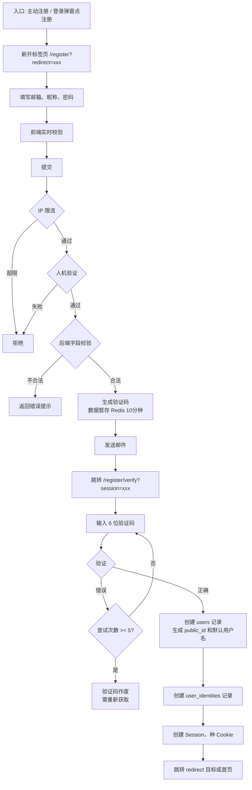
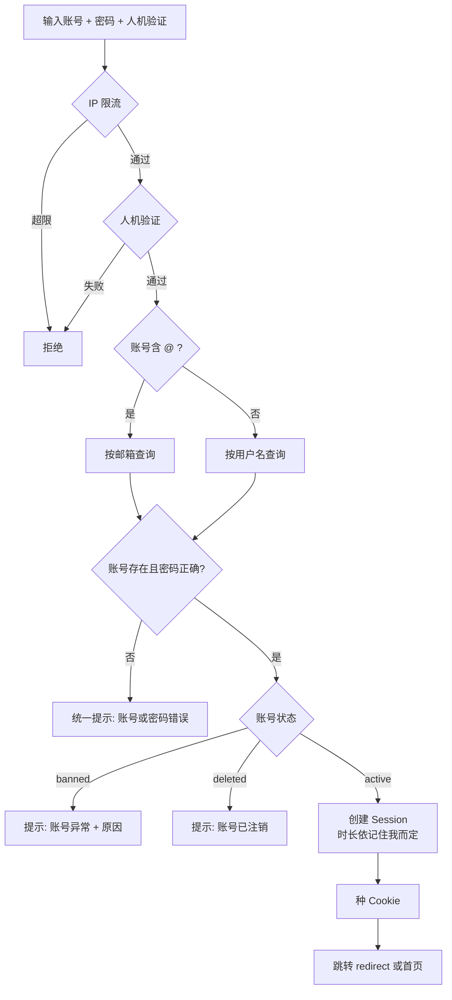
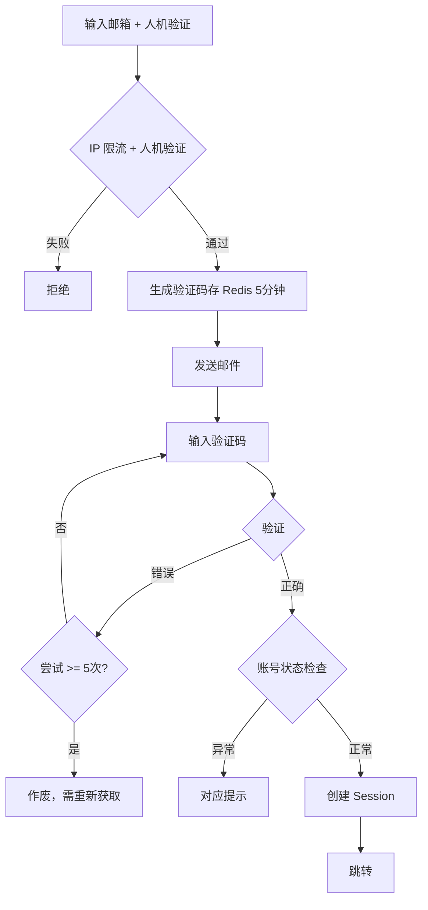
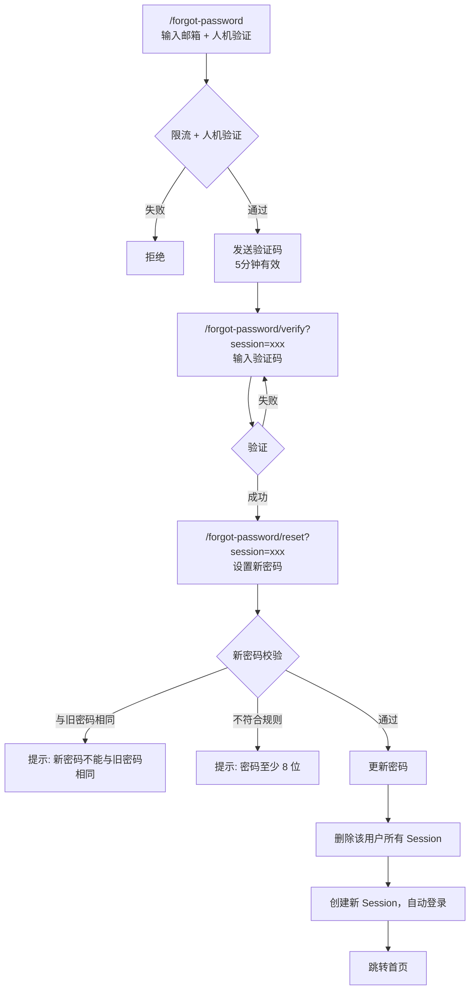
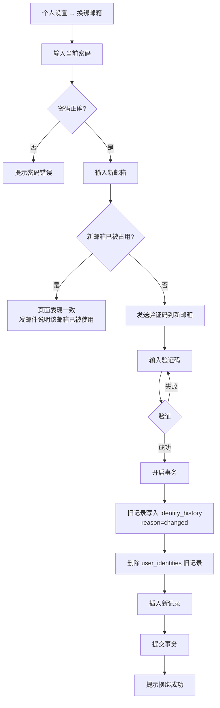
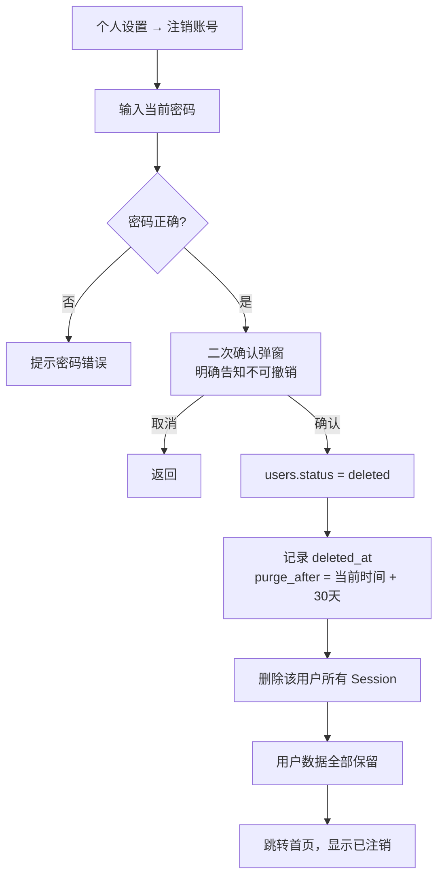
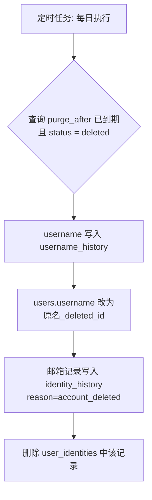
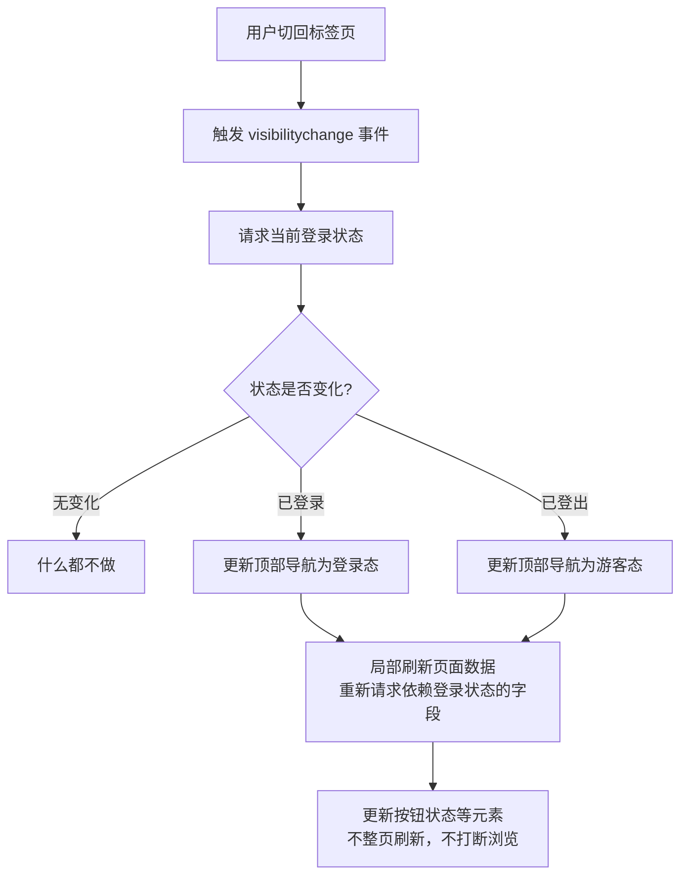

# 注册登录系统设计（v1）

## 一、范围

### v1 实现
- 邮箱注册（验证码验证）
- 登录：密码登录 / 验证码登录
- 忘记密码
- 换绑邮箱
- 账号注销
- 会话管理（设备列表、单设备下线）

### v1 不实现，但结构预留
- 手机号注册登录（v2）
- 第三方登录（微信、QQ 等，受个人开发者资质限制）
- 头像上传（仅预留字段）
- 个人资料编辑

## 二、技术方案

| 项 | 方案 | 决策依据 |
|---|---|---|
| 会话 | Session + Redis + HttpOnly Cookie | ADR-003、ADR-004 |
| 用户标识 | 内部自增 id + 对外 NanoID + username | ADR-005 |
| URL 格式 | `/@username` | ADR-005 |
| 邮箱验证 | 6 位数字验证码 | ADR-006 |
| 人机验证 | 阿里云验证码 | 国内访问稳定，与服务器同厂商 |
| 密码加密 | bcrypt | 慢哈希，抗暴力破解 |

## 三、核心流程

### 3.1 注册



**邮箱已注册的处理**：页面表现完全一致（显示"验证码已发送"），实际发送的邮件内容为"有人使用您的邮箱尝试注册，如果是您本人请直接登录"。

**同一邮箱重复提交**：覆盖旧申请，旧验证码立即失效，永远以最新为准。

**刷新页面**：通过 URL 中的 session 标识恢复状态。

**关闭标签页**：流程作废，需重新注册。

**默认用户名格式**：`user_` + 6 位随机小写字母数字，重复则重新生成。

### 3.2 登录

**两种入口**：
- 弹窗：浏览中触发需登录的操作，不离开当前页
- 独立页 `/login?redirect=xxx`：直接访问、外部链接跳转

**密码登录流程**：



**验证码登录流程**：



**邮箱不存在时**：页面表现一致，发送"该邮箱未注册"的提示邮件。

**注意**：验证码登录绕过密码，因此登录后的敏感操作（改密码、换绑邮箱、注销）仍需输入密码验证。

### 3.3 忘记密码



**邮箱不存在**：页面表现一致，发送"该邮箱未注册"的提示邮件。

### 3.4 换绑邮箱



**不强制下线其他设备**：换绑邮箱跟改密码/账号注销不同——账号本身没有失控迹象（操作者已经用当前密码验证过身份），只是换了个登录凭证，所以当前 Session 和其他所有已登录设备都维持原状，不做强制登出。

**换绑成功后通知旧邮箱**：事务提交后，会向换绑前的旧邮箱发一封安全通知（"账号邮箱已被更换为 xxx，如果不是本人操作请尽快联系我们或重置密码"），给本人一个能察觉异常并找回账号的机会——即使当前所有设备的 Session 都还有效，旧邮箱本身作为一条独立的联系渠道，通知不依赖 Session 状态。

### 3.5 注销



**30 天后的清理任务**：



**注销后的表现**：

| 场景 | 表现 |
|---|---|
| 尝试登录 | 提示"账号已注销" |
| 30 天内他人用同邮箱注册 | 页面表现一致，发邮件说明冷却期 |
| 历史内容中的作者显示 | "该用户已注销"，不可点击进入主页 |
| 后台查询 | `WHERE status='deleted'` 可筛选 |
| 用户数据 | 照片、评论等全部保留，一条不删 |

### 3.6 登出

删除当前 Session，清除 Cookie，跳转首页。仅退出当前设备。

"退出所有设备"作为设置页的独立功能。

## 四、会话管理

### 4.1 超时策略

| | 不勾"记住我" | 勾选"记住我" |
|---|---|---|
| 闲置超时 | 4 小时 | 30 天 |
| 绝对超时 | 7 天 | 90 天 |

两种超时同时生效，任一触发即登出。

### 4.2 设备管理

Session 中记录：设备类型、浏览器、IP、登录时间、最后活动时间。

用户可在设置中查看登录设备列表（标记当前设备），可单独下线某设备。

**对外标识与真实凭证分离**：Session 除了真实的 sessionId（只存在于 HttpOnly Cookie 和 Redis key 里，绝不返回给前端）之外，还会生成一个独立的 `ref`（NanoID）。设备列表接口只返回 `ref`，前端拿 `ref` 标识和操作某条会话；`ref` 泄露了也不能当登录凭证使用，跟真实 sessionId 是两个完全独立的值。

**惰性清理**：`user_sessions:{userId}` 这个 Set 会因为 Session 自然过期（Redis TTL 到期）而出现"集合里有 sessionId，但对应的 `session:{sessionId}` 已经不存在"的情况。查询设备列表时，遇到这种情况会顺手把该 sessionId 从集合里移除，不等定时任务，也不会出现在返回结果里。

**当前设备不可通过设备管理下线**：下线操作会检查目标是否是发起请求本身所在的那个 Session，如果是，拒绝操作并提示改用登出功能——下线当前设备和登出是同一件事，不应该有两条不同的路径做同一件事。

**接口**：
- `GET /api/auth/sessions`：返回当前用户所有有效 Session（`ref`/`deviceType`/`browser`/`ip`/`createdAt`/`lastActiveAt`/`isCurrent`）
- `DELETE /api/auth/sessions/:ref`：下线指定设备。找不到匹配的 `ref`（已过期、伪造、或不属于当前用户）统一提示"该设备不存在或已下线"，不区分具体原因，遵循"统一错误提示，不泄露信息"的安全原则（design-principles.md 1.1）

### 4.3 强制下线场景

- 用户主动登出（当前设备）
- 用户在设备管理中下线某设备
- 密码重置成功（所有设备）
- 账号被封禁（所有设备）
- 账号注销（所有设备）

### 4.4 多标签状态同步



## 五、安全措施

| 措施 | 说明 |
|---|---|
| IP 限流 | 登录 15 分钟 30 次，注册 15 分钟 20 次 |
| 人机验证 | 阿里云验证码，注册/登录/发送验证码前 |
| 验证码限制 | 有效期、最大尝试次数、重发冷却、每小时上限 |
| 统一错误提示 | 不泄露账号存在性 |
| 重定向白名单 | 只允许站内路径 |
| 敏感操作二次验证 | 改密码、换绑邮箱、注销需输入密码 |
| 密码加密 | bcrypt |

## 六、配置参数

```javascript
username: {
  minLength: 3,
  maxLength: 20,
  charset: 'ascii',           // 字母、数字、下划线
  allowPureNumber: false,
  caseSensitive: false,
  cooldownDays: 90,
  maxChangesPerYear: 2,
}

nickname: {
  maxLength: 30,
  changeLimit: { days: 14, times: 2 },
}

password: {
  minLength: 8,
  requireComplexity: false,   // 不强制字符类型，遵循 NIST 建议
}

session: {
  normal:   { idleHours: 4,  absoluteDays: 7 },
  remember: { idleDays: 30,  absoluteDays: 90 },
}

verification: {
  register:      { expireMin: 10, maxAttempts: 5, cooldownSec: 60, maxPerHour: 5 },
  login:         { expireMin: 5,  maxAttempts: 5, cooldownSec: 60, maxPerHour: 5 },
  resetPassword: { expireMin: 5,  maxAttempts: 5, cooldownSec: 60, maxPerHour: 3 },
  changeEmail:   { expireMin: 5,  maxAttempts: 5, cooldownSec: 60, maxPerHour: 3 },
}

account: {
  deleteCooldownDays: 30,
}

rateLimit: {
  login:    { windowMin: 15, max: 30 },
  register: { windowMin: 15, max: 20 },
}

reservedUsernames: [
  // 路径冲突
  'admin', 'api', 'login', 'register', 'settings', 'help', 'about',
  'terms', 'privacy', 'static', 'assets', 'public', 'explore', 'search',
  // 品牌保护
  'photoer', 'photoer_official', 'photoer_app', 'photoer_support',
  // 冒充防范
  'official', 'support', 'staff', 'team', 'service', 'moderator',
  'system', 'root', 'security', 'verify',
  // 状态保留
  'deleted',
]
```

## 七、已知限制与后续规划

### 已知限制

| 限制 | 说明 | 缓解措施 |
|---|---|---|
| 验证码登录绕过密码 | 邮箱被盗则账号可被登录 | 敏感操作需二次密码验证 |
| 闲置超时防不了短时接触 | 用户离开 10 分钟被人操作 | 需敏感操作二次验证配合 |
| 阿里云验证码海外访问 | 海外用户可能较慢 | 有海外用户后考虑多区域方案 |

### 后续规划

- v2：手机号注册登录、手机号换绑
- 弱密码黑名单检测
- 异地登录提醒（需 IP 地理位置库）
- 登录历史记录表
- 第三方登录（需企业资质）
- Cookie 合规弹窗（面向欧盟用户时）