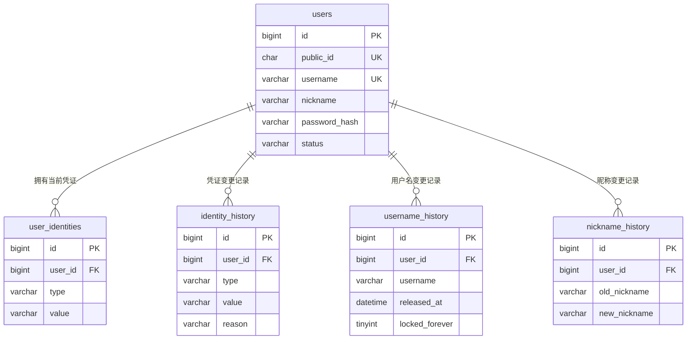
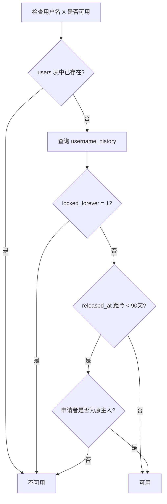

# 数据库设计

## 一、命名与类型约定

- 表名：小写复数，下划线分隔（`users`、`user_identities`）
- 字段名：小写下划线分隔
- 主键统一 `id`，类型 `BIGINT UNSIGNED AUTO_INCREMENT`
- 时间字段统一 `DATETIME`
- 布尔值用 `TINYINT(1)`
- 字符集 `utf8mb4`，排序规则 `utf8mb4_0900_ai_ci`（不区分大小写）

## 二、表关系概览

## 三、表结构

### users

用户主表。

| 字段 | 类型 | 约束 | 说明 |
|---|---|---|---|
| id | BIGINT UNSIGNED | PK, AUTO_INCREMENT | 内部主键，永不对外暴露 |
| public_id | CHAR(21) | UNIQUE, NOT NULL | NanoID，对外标识，永不变 |
| username | VARCHAR(50) | UNIQUE, NOT NULL | 登录名与 URL 标识 |
| nickname | VARCHAR(30) | NOT NULL | 显示名，不唯一 |
| password_hash | VARCHAR(255) | NOT NULL | bcrypt 哈希 |
| avatar_path | VARCHAR(255) | NULL | OSS 路径，不含域名 |
| status | VARCHAR(20) | NOT NULL, DEFAULT 'active' | active / banned / deleted |
| banned_until | DATETIME | NULL | NULL 表示永久封禁 |
| ban_reason | VARCHAR(255) | NULL | 封禁原因 |
| username_customized | TINYINT(1) | NOT NULL, DEFAULT 0 | 是否改过默认用户名 |
| last_active_at | DATETIME | NULL | 最后活跃时间 |
| deleted_at | DATETIME | NULL | 注销时间 |
| purge_after | DATETIME | NULL | 释放 username 与邮箱的时间 |
| created_at | DATETIME | NOT NULL | |
| updated_at | DATETIME | NOT NULL | |

**索引**

| 类型 | 字段 | 用途 |
|---|---|---|
| PRIMARY | id | |
| UNIQUE | public_id | 对外查询 |
| UNIQUE | username | 唯一性保证与 URL 查询 |
| INDEX | status | 后台筛选（如查所有已注销用户） |
| INDEX | purge_after | 定时清理任务查询 |

**说明**

- `username` 字段长度 50，但应用层限制注册与改名为 3-20 字符。多出的余量用于注销后拼接 `_deleted_{id}` 后缀
- `avatar_path` 只存路径不存完整 URL，域名放配置文件，便于更换 CDN 或存储服务
- `last_active_at` 由 Redis 缓冲，定期（每 5 分钟）同步到此字段，避免每次请求都写库
- `status` 用 VARCHAR 而非 ENUM，便于未来增加状态值（如 muted）而不需改表结构

### user_identities

当前有效的登录凭证。

| 字段 | 类型 | 约束 | 说明 |
|---|---|---|---|
| id | BIGINT UNSIGNED | PK, AUTO_INCREMENT | |
| user_id | BIGINT UNSIGNED | NOT NULL | 关联 users.id |
| type | VARCHAR(20) | NOT NULL | email（v2 增加 phone） |
| value | VARCHAR(255) | NOT NULL | 邮箱地址 |
| verified_at | DATETIME | NOT NULL | 验证时间 |
| created_at | DATETIME | NOT NULL | 绑定时间 |

**索引**

| 类型 | 字段 | 用途 |
|---|---|---|
| PRIMARY | id | |
| UNIQUE | (type, value) | 保证同一凭证不被多人占用 |
| INDEX | user_id | 查询某用户的所有凭证 |

**说明**

- 只存当前有效凭证，已解绑的记录移入 identity_history
- 这样设计使唯一索引不与历史记录冲突
- v1 中一个用户同时只有一条 email 记录，换绑即"归档旧的 + 插入新的"
- 注销 30 天后，该用户的记录被删除（归档到 history）

### identity_history

登录凭证的变更历史。

| 字段 | 类型 | 约束 | 说明 |
|---|---|---|---|
| id | BIGINT UNSIGNED | PK, AUTO_INCREMENT | |
| user_id | BIGINT UNSIGNED | NOT NULL | |
| type | VARCHAR(20) | NOT NULL | |
| value | VARCHAR(255) | NOT NULL | |
| bound_at | DATETIME | NOT NULL | 绑定时间 |
| removed_at | DATETIME | NOT NULL | 解绑时间 |
| reason | VARCHAR(20) | NOT NULL | changed / account_deleted |

**索引**

| 类型 | 字段 | 用途 |
|---|---|---|
| PRIMARY | id | |
| INDEX | user_id | 查询某用户的凭证变更史 |
| INDEX | (type, value) | 查询某邮箱曾属于谁 |

**说明**：无唯一索引，允许同一邮箱多次出现（被不同用户先后使用过）。

### username_history

用户名变更历史，同时承担冷却期判断职责。

| 字段 | 类型 | 约束 | 说明 |
|---|---|---|---|
| id | BIGINT UNSIGNED | PK, AUTO_INCREMENT | |
| user_id | BIGINT UNSIGNED | NOT NULL | 曾使用此名的用户 |
| username | VARCHAR(20) | NOT NULL | 历史用户名 |
| released_at | DATETIME | NOT NULL | 释放时间 |
| locked_forever | TINYINT(1) | NOT NULL, DEFAULT 0 | 是否永久锁定 |
| created_at | DATETIME | NOT NULL | |

**索引**

| 类型 | 字段 | 用途 |
|---|---|---|
| PRIMARY | id | |
| INDEX | username | 注册和改名时查询冷却期 |
| INDEX | user_id | 查询某用户的改名史 |

**冷却期判断逻辑**

### nickname_history

昵称变更历史，用于频率限制与追溯。

| 字段 | 类型 | 约束 |
|---|---|---|
| id | BIGINT UNSIGNED | PK, AUTO_INCREMENT |
| user_id | BIGINT UNSIGNED | NOT NULL |
| old_nickname | VARCHAR(30) | NOT NULL |
| new_nickname | VARCHAR(30) | NOT NULL |
| changed_at | DATETIME | NOT NULL |

**索引**

| 类型 | 字段 | 用途 |
|---|---|---|
| PRIMARY | id | |
| INDEX | (user_id, changed_at) | 统计时间窗口内的改名次数 |

**频率限制逻辑**：查询该用户最近 14 天内的记录数，达到 2 条则拒绝。

## 四、Redis 数据结构

| Key 模式 | 类型 | 内容 | 过期 |
|---|---|---|---|
| `session:{sessionId}` | Hash | userId, deviceType, browser, ip, createdAt, lastActiveAt, remember | 按闲置超时 |
| `user_sessions:{userId}` | Set | 该用户所有 sessionId | 无 |
| `registration:{token}` | Hash | email, nickname, passwordHash, code, attempts | 10 分钟 |
| `login_code:{token}` | Hash | email, code, attempts | 5 分钟 |
| `reset_pwd:{token}` | Hash | userId, code, attempts | 5 分钟 |
| `change_email:{token}` | Hash | userId, newEmail, code, attempts | 5 分钟 |
| `ratelimit:login:{ip}` | String | 计数 | 15 分钟 |
| `ratelimit:register:{ip}` | String | 计数 | 15 分钟 |
| `email_cooldown:{scope}:{email}` | String | 单封邮件重发冷却标记，`scope` 为 `register`/`login`/`reset` | 按各流程 cooldownSec 配置 |
| `email_send:{scope}:{email}` | String | 该邮箱在该场景下的发送次数 | 1 小时 |
| `user:{userId}:last_active` | String | 时间戳 | 无 |

**说明**

- 注册中间态存 Redis 而非 MySQL，因为有自动过期需求，且未完成的注册不应污染主表
- 密码在存入 Redis 前已完成 bcrypt 加密，不以明文形式存在于任何位置
- `user_sessions` 集合用于"删除该用户所有 Session"（封禁、改密码、注销时）
- `email_cooldown`/`email_send` 按 `scope` 隔离，注册、验证码登录、忘记密码互不影响发送冷却和每小时上限，避免同一邮箱刚发过一种验证码就把另一种流程也卡住

## 五、设计说明

### 5.1 为什么当前状态与历史记录分表

若在同一张表用 `removed_at` 字段区分当前与历史：

- 唯一索引会与历史记录冲突（同一邮箱在历史和当前都存在）
- MySQL 不支持部分唯一索引（PostgreSQL 支持 WHERE 条件）

分表后，当前表可以放心加唯一索引，历史表允许重复。

### 5.2 为什么 username 留在 users 表而非 identities

| | username | email / phone |
|---|---|---|
| 性质 | 身份标识（指代这个人） | 登录凭证（证明我是我） |
| 数量 | 只能有一个 | 可以有多个 |
| 用途 | URL 的一部分 | 登录、接收通知 |

两者性质不同，不应混在一起。

### 5.3 双 ID 的使用边界

| ID | 用在哪 | 绝对不能出现在哪 |
|---|---|---|
| `id` | 数据库内部、表关联 | API 响应、URL、前端代码 |
| `public_id` | API 响应、需要稳定引用时 | — |
| `username` | URL、提及、搜索 | 数据库关联（因为会变） |

**核心纪律**：内部 `id` 永不离开服务器。所有用户数据返回前必须经过序列化函数处理，由它决定哪些字段可以对外。

### 5.4 外键约束

**决策**：暂不启用数据库层面的 FOREIGN KEY 约束，由应用层保证关联完整性。

**理由**：

| | 启用外键 | 不启用 |
|---|---|---|
| 数据完整性 | 数据库强制保证 | 靠应用层与测试 |
| 写入性能 | 每次写入需检查约束 | 更快 |
| 表结构变更 | 需先删约束，操作繁琐 | 灵活 |
| 分库分表 | 无法跨库使用 | 无影响 |

互联网项目多数选择不用外键（性能与灵活性优先），传统企业应用多数启用。当前项目规模小、迭代频繁，选择不启用。

**代价**：若应用层有 bug，可能产生孤儿记录（指向不存在用户的记录）。需通过代码规范和定期数据校验来防范。

## 六、变更记录

| 日期 | 变更 |
|---|---|
| 2026-08-21 | 初版设计 |